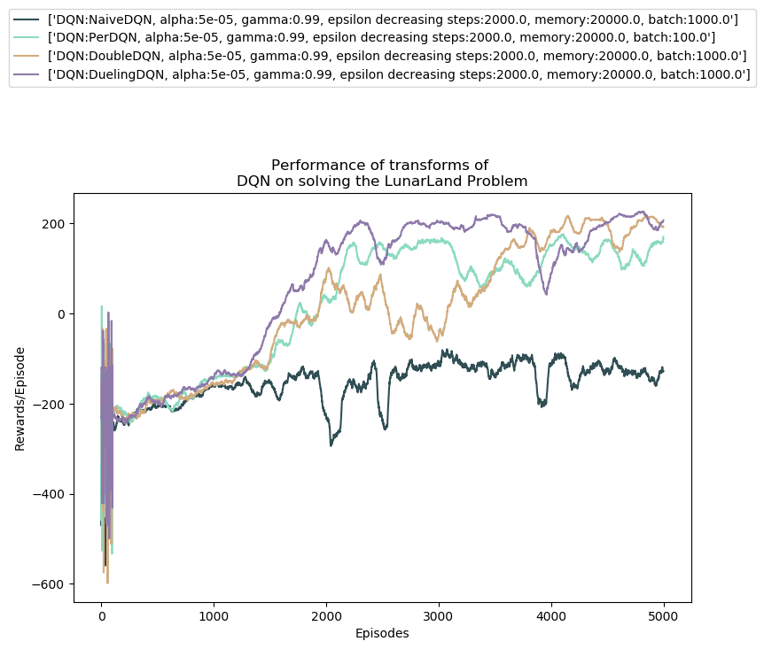
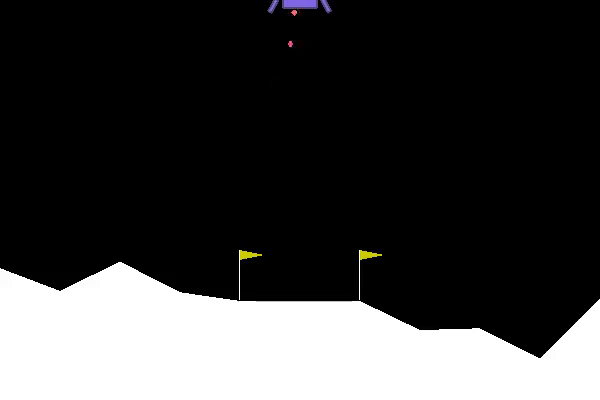
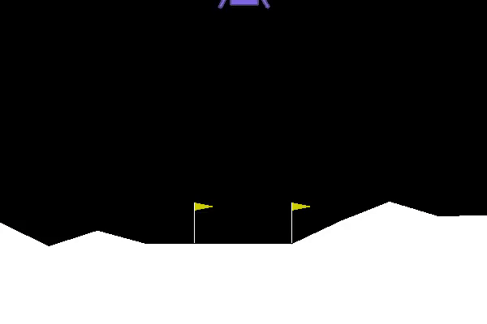

 

<figure class = "titled-image">
    
    <figcaption>Zach Zhang at Yellowstone in 2017</figcaption>
</figure>

### Who am I

My name is Zach Zhang, a MS CS student in Georgia Tech. My specialization is <b>Machine Learning</b> and <b>Computational Perception</b>.

 

I am also a full time Data Scientist for <a href="http://www.seluxdx.com/">SeLux Diagnostics Inc</a>, a biotechnology company, where the team were building 
the next generation high throughput FDA required antibiotic susceptibility testing (“AST”) device for clinical labs to run AST test for infectious disease efficiently
and precisely. Quite amount of data were generated from bio-experiments, chemical-experiments, device running, patient samples, I used <b>OOP</b> to capture those information 
from various objects such as physical device parameter, microbiological plates incubation result, chemical reagents fluorescence value, bacterial genra, 
drug concentration, patient record, then built their relationship, and then developed and applied machine learning algorithms (<b>Kernel Bayes, XGB, hmm, Bayes nets with Chow-Liu algorithm, conditional random fields, 
and deep learning LSTM</b>) to do different predication, such as minimum antibiotic susceptible concentration for different sample, and built a multi-functional software 
to embed the algorithms into the system of device for seamlessly device running and <b>algorithm training, testing, and web-visualization</b> using the <b>multi-threads pipe</b> and 
<b>ASP.NET web service</b> to communicate data between device, database, and algorithm development platform (such as python, tensorflow, Matlab, R)<a href="https://github.com/zzh237/SeLux">(github).</a>

<figure>
  
</figure>
<figure>
  
</figure>
<figure>
    
</figure>

### Career Goal

I was original studying Agricultural related science in University of Kentucky and China Agricultural University. At the same time, I have sincere love for math, programming, and engineering, so I worked severl years as Data Scientist and Engineer in the industry, now I am pursuing the Computer Science master degree in Georgia Tech, I should be thankful that I have learned math and programming well in college and during my years of working experience, and I met computer science when I was at the lowest point of my life. I hope I can further develop solid skills in this field, enjoy every step of learning. 

 

With the help from MOOC, I was able to quickly catch up. I have done a good number of elementary machine learning, deep learning, artificial intelligence and data science projects indepedently. So I would like to challenge myself more by doing some state-of-art machine learning and artificial intelligence researches. I am currently seeking machine learning and artificial intelligence research opportunities not only in the Georgia Tech but also in the other areas in the United States.

### Projects

Georgia Tech’s CS7641 ML class has four fairly involved projects. <a href ="https://drive.google.com/open?id=1CKulfMYYOr_cs86v48-KcSf8QiytfbHO">supervised learning</a>, <a href ="https://drive.google.com/open?id=1jMAsi-wVYdruQQTWWGKeoFV9NzBmCvda">randomized optimization</a>, <a href ="https://drive.google.com/open?id=1ywQx8xkWuFNqYK2NYOw2Pdddl9NkRLVP">unsupervised learning</a>, and <a href ="https://drive.google.com/open?id=1cd3hXTwb1pvLT8AO-PiUOTGLStOIsDBA">Markov Decision Processes</a>. 

 

Computer Vision: 
Activity classification using MHI: In class project, I classified different human movements behavior by training video data containing multiple human movements, 
using the motion history image stack to represent the video data, performed background subtraction, motion history images moments calculation, 
and applied different classifiers to train the image moments, then predicated the human behavior from real-world video [<a href ="https://drive.google.com/open?id=1bePGRlxUlnrkpv3T5gDZI4h4d5zAr9bv">PDF</a>].  

 

 
Bayes Nets with Chow-Liu to do multi-classification of photos:

I collected data from instagram photos of five national parks. I then trained up a classifier that correctly predicts the park from a photo. This is a non-trivial task, since naive approach -- using each pixel as a feature -- will fail. To see why consider the two photos below.
<figure>
    
</figure>
Landmark occurs in both photos but not in the same position in the image. Further due to the opening in the arch, middle of the photo may be occupied by sky or rock. At best, treating pixels as feature we can analyze image in terms of color frequencies -- how intense are the red,green and blue channel.

Instead of using each pixel as a feature, I used features -- computed by a neural network -- which aggregate information about edges, shapes, and color intensities across the whole image to do prediction.
I trained a prediction model which takes distilled representation of the photos, 1000 features per picture, and predicts where the photo was taken. 
I modeled features in the dataset using Bayesian networks, one for each class -- natural park. I implement learning of the tree structure for each class using Chow-Liu algorithm, then
I used the tree structure to learn parameters for conditional probabilities associated with edges in these trees, then 
I computed probability of a feature vector xx in each of the five Bayesian networks, then I computed probabilities that the feature vector xx belongs to each class, then I made predictions based on probabilities (1pt)
and explored prediction performance. 

<figure>
    
  <figcaption> confusion matrix</figcaption>
</figure>
<figure>
    
  <figcaption> incorrect predicted photo </figcaption>
</figure>

 
AI for Robotics project:
Simulated Intelligent Robot Tracking Agent: in course project, I developed a naive intelligent agent to predict the future trajectory of a Nano robot’s dynamic moving position; 
evaluated multiple training algorithms in Bayesian probabilistic model, linear-Gaussian model (Kalman Filters), sequential Monte Carlo simulation (particle filters), 
residual learning model; reduced video data dimensionality by PCA; tuned residual neural network hyperparameters 
and applied bootstrap aggregation with multiple residual neural networks [<a href ="https://drive.google.com/open?id=1h349nlaTj-p_aJAxRO1wWl6PvWtd7ose">PDF</a>].
<figure>
    
</figure>
<figure>

</figure>

 

Deep Q-Networks:
I implemented Deep Q-networks using tensorflow to solve the LunarLander problem in the OpenGym AI. Three different techniques were applied to improve the performance of deep Q-Networks, which are <a href ="https://arxiv.org/pdf/1509.06461.pdf">double deep Q-Networks</a>, 
<a href ="https://arxiv.org/pdf/1511.06581.pdf">dueling deep Q-Networks</a>, and <a href ="https://arxiv.org/pdf/1511.05952.pdf">prioritized experience replay</a>. The scores per episode were compared [<a href ="https://drive.google.com/open?id=1sDkJUoM2ZCd9DocFZo8siLoN_U7iI32J">PDF</a>].     
<figure>
  
</figure>
<figure>
    
  <figcaption> Episode 0 </figcaption>
</figure>
<figure>
    
  <figcaption> Episode 5000 </figcaption>
</figure>